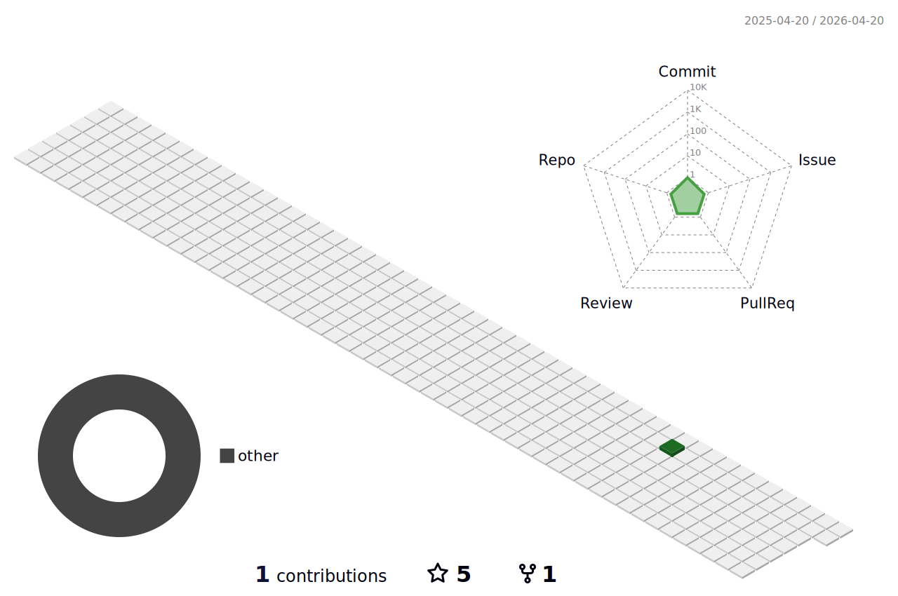

### Hi there 👋


I'm Antoine, a passionate Web Developer from France.

## :zap: Private stats (about my personal or professional projects) : 

<!--START_SECTION:waka-->

```txt
From: 19 April 2022 - To: 31 January 2026

Total Time: 1,964 hrs 2 mins

PHP                        1,188 hrs 41 mins███████████████░░░░░░░░░░   60.52 %
Twig                       158 hrs 41 mins ██░░░░░░░░░░░░░░░░░░░░░░░   08.08 %
SQL                        108 hrs 11 mins █▒░░░░░░░░░░░░░░░░░░░░░░░   05.51 %
HTML                       60 hrs 22 mins  ▓░░░░░░░░░░░░░░░░░░░░░░░░   03.07 %
JavaScript                 54 hrs 51 mins  ▓░░░░░░░░░░░░░░░░░░░░░░░░   02.79 %
XML                        31 hrs 58 mins  ▒░░░░░░░░░░░░░░░░░░░░░░░░   01.63 %
Markdown                   22 hrs 58 mins  ▒░░░░░░░░░░░░░░░░░░░░░░░░   01.17 %
Python                     20 hrs 44 mins  ▒░░░░░░░░░░░░░░░░░░░░░░░░   01.06 %
Text                       19 hrs 21 mins  ▒░░░░░░░░░░░░░░░░░░░░░░░░   00.99 %
Smarty                     19 hrs 5 mins   ▒░░░░░░░░░░░░░░░░░░░░░░░░   00.97 %
HTTP Request               17 hrs 5 mins   ▒░░░░░░░░░░░░░░░░░░░░░░░░   00.87 %
Makefile                   13 hrs 30 mins  ▒░░░░░░░░░░░░░░░░░░░░░░░░   00.69 %
.env file                  12 hrs 15 mins  ░░░░░░░░░░░░░░░░░░░░░░░░░   00.62 %
Bash                       9 hrs 58 mins   ░░░░░░░░░░░░░░░░░░░░░░░░░   00.51 %
CSS                        9 hrs 8 mins    ░░░░░░░░░░░░░░░░░░░░░░░░░   00.47 %
TypeScript                 6 hrs 2 mins    ░░░░░░░░░░░░░░░░░░░░░░░░░   00.31 %
Docker                     5 hrs 46 mins   ░░░░░░░░░░░░░░░░░░░░░░░░░   00.29 %
SCSS                       5 hrs 41 mins   ░░░░░░░░░░░░░░░░░░░░░░░░░   00.29 %
Other                      4 hrs 45 mins   ░░░░░░░░░░░░░░░░░░░░░░░░░   00.24 %
```

<!--END_SECTION:waka-->

## :trophy: Opensource stats (seriously, who doesn't like stats ??) : 

<!---
[](https://github.com/anuraghazra/github-readme-stats) 
-->





## :stuck_out_tongue_winking_eye: A random joke ? : 

<a href="https://readme-jokes.vercel.app"></a>
