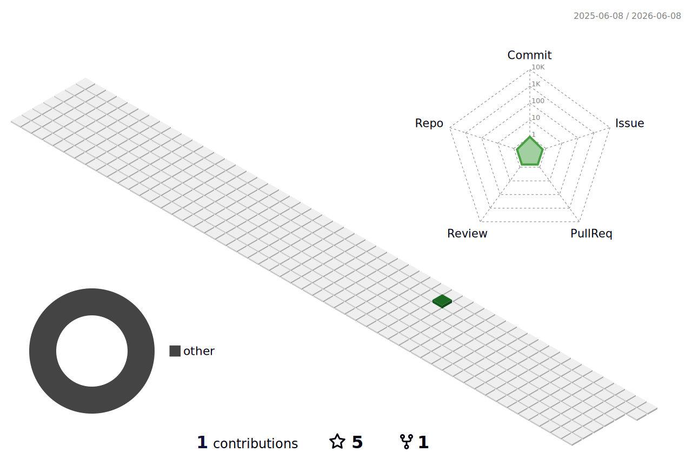

### Hi there 👋


I'm Antoine, a passionate Web Developer from France.

## :zap: Private stats (about my personal or professional projects) : 

<!--START_SECTION:waka-->

```txt
From: 21 July 2025 - To: 21 July 2026

Total Time: 362 hrs

PHP              261 hrs 14 mins       ██████████████████░░░░░░░   72.16 %
Twig             17 hrs 9 mins         █▒░░░░░░░░░░░░░░░░░░░░░░░   04.74 %
JavaScript       11 hrs 44 mins        ▓░░░░░░░░░░░░░░░░░░░░░░░░   03.24 %
.env file        9 hrs 37 mins         ▓░░░░░░░░░░░░░░░░░░░░░░░░   02.66 %
```

<!--END_SECTION:waka-->

## :trophy: Opensource stats (seriously, who doesn't like stats ??) : 

<!---
[](https://github.com/anuraghazra/github-readme-stats) 
-->





## :stuck_out_tongue_winking_eye: A random joke ? : 

<a href="https://readme-jokes.vercel.app"></a>
