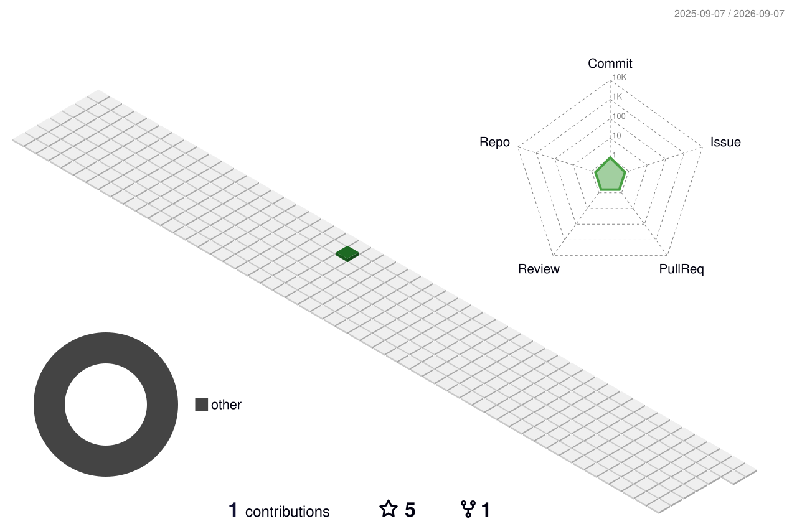

### Hi there 👋


I'm Antoine, a passionate Web Developer from France.

## :zap: Private stats (about my personal or professional projects) : 

<!--START_SECTION:waka-->

```txt
From: 13 August 2025 - To: 13 August 2026

Total Time: 400 hrs 27 mins

PHP              291 hrs 55 mins       ██████████████████▒░░░░░░   72.90 %
Twig             18 hrs 3 mins         █░░░░░░░░░░░░░░░░░░░░░░░░   04.51 %
JavaScript       11 hrs 57 mins        ▓░░░░░░░░░░░░░░░░░░░░░░░░   02.99 %
.env file        11 hrs 44 mins        ▓░░░░░░░░░░░░░░░░░░░░░░░░   02.93 %
```

<!--END_SECTION:waka-->

## :trophy: Opensource stats (seriously, who doesn't like stats ??) : 

<!---
[](https://github.com/anuraghazra/github-readme-stats) 
-->





## :stuck_out_tongue_winking_eye: A random joke ? : 

<a href="https://readme-jokes.vercel.app"></a>
