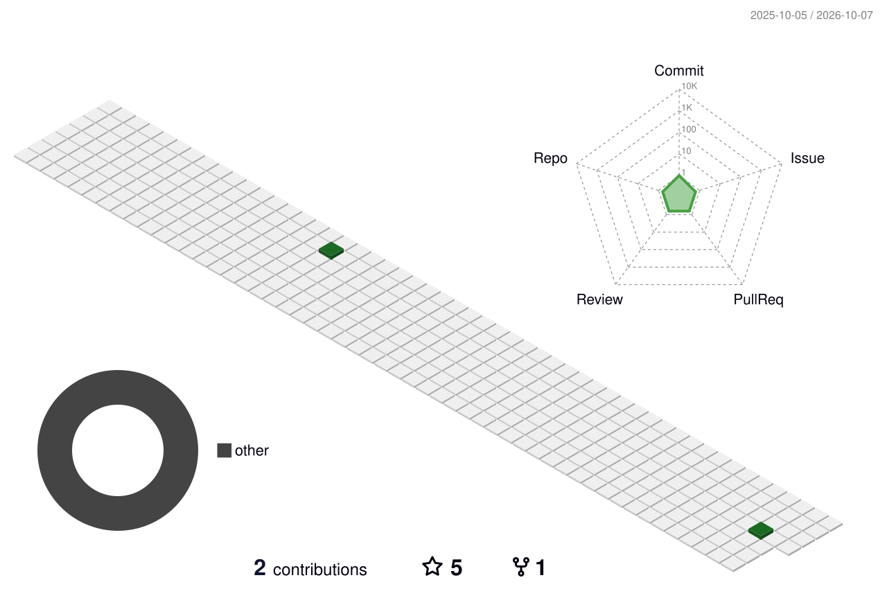

### Hi there 👋


I'm Antoine, a passionate Web Developer from France.

## :zap: Private stats (about my personal or professional projects) : 

<!--START_SECTION:waka-->

```txt
From: 07 October 2025 - To: 07 October 2026

Total Time: 442 hrs 20 mins

PHP              313 hrs 11 mins       █████████████████▓░░░░░░░   70.81 %
Twig             18 hrs 41 mins        █░░░░░░░░░░░░░░░░░░░░░░░░   04.22 %
.env file        13 hrs 13 mins        ▓░░░░░░░░░░░░░░░░░░░░░░░░   02.99 %
JavaScript       12 hrs 7 mins         ▓░░░░░░░░░░░░░░░░░░░░░░░░   02.74 %
```

<!--END_SECTION:waka-->

## :trophy: Opensource stats (seriously, who doesn't like stats ??) : 

<!---
[](https://github.com/anuraghazra/github-readme-stats) 
-->





## :stuck_out_tongue_winking_eye: A random joke ? : 

<a href="https://readme-jokes.vercel.app"></a>
