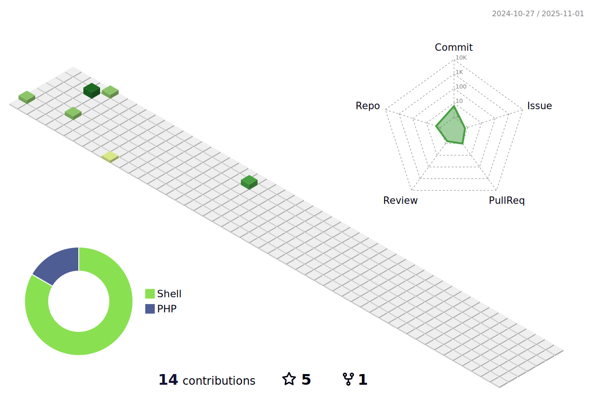

### Hi there 👋


I'm Antoine, a passionate Web Developer from France.

## :zap: Private stats (about my personal or professional projects) : 

<!--START_SECTION:waka-->

```txt
From: 19 April 2022 - To: 23 December 2024

Total Time: 1,884 hrs 37 mins

PHP                        1,143 hrs 11 mins███████████████░░░░░░░░░░   60.66 %
Twig                       144 hrs 52 mins ██░░░░░░░░░░░░░░░░░░░░░░░   07.69 %
SQL                        106 hrs 38 mins █▒░░░░░░░░░░░░░░░░░░░░░░░   05.66 %
HTML                       56 hrs 33 mins  ▓░░░░░░░░░░░░░░░░░░░░░░░░   03.00 %
JavaScript                 52 hrs 39 mins  ▓░░░░░░░░░░░░░░░░░░░░░░░░   02.79 %
XML                        29 hrs 7 mins   ▒░░░░░░░░░░░░░░░░░░░░░░░░   01.55 %
Markdown                   22 hrs 44 mins  ▒░░░░░░░░░░░░░░░░░░░░░░░░   01.21 %
Python                     20 hrs 44 mins  ▒░░░░░░░░░░░░░░░░░░░░░░░░   01.10 %
Smarty                     19 hrs 5 mins   ▒░░░░░░░░░░░░░░░░░░░░░░░░   01.01 %
HTTP Request               17 hrs 4 mins   ▒░░░░░░░░░░░░░░░░░░░░░░░░   00.91 %
Text                       16 hrs 56 mins  ▒░░░░░░░░░░░░░░░░░░░░░░░░   00.90 %
Makefile                   12 hrs 29 mins  ░░░░░░░░░░░░░░░░░░░░░░░░░   00.66 %
.env file                  11 hrs 28 mins  ░░░░░░░░░░░░░░░░░░░░░░░░░   00.61 %
Bash                       9 hrs 44 mins   ░░░░░░░░░░░░░░░░░░░░░░░░░   00.52 %
CSS                        7 hrs 34 mins   ░░░░░░░░░░░░░░░░░░░░░░░░░   00.40 %
TypeScript                 6 hrs 2 mins    ░░░░░░░░░░░░░░░░░░░░░░░░░   00.32 %
Docker                     5 hrs 45 mins   ░░░░░░░░░░░░░░░░░░░░░░░░░   00.31 %
SCSS                       5 hrs 41 mins   ░░░░░░░░░░░░░░░░░░░░░░░░░   00.30 %
Other                      4 hrs 34 mins   ░░░░░░░░░░░░░░░░░░░░░░░░░   00.24 %
```

<!--END_SECTION:waka-->

## :trophy: Opensource stats (seriously, who doesn't like stats ??) : 

<!---
[](https://github.com/anuraghazra/github-readme-stats) 
-->





## :stuck_out_tongue_winking_eye: A random joke ? : 

<a href="https://readme-jokes.vercel.app"></a>
